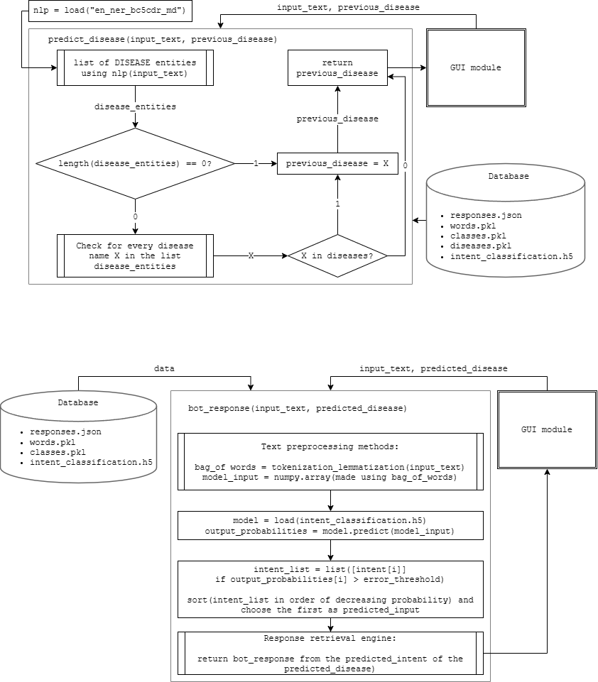

# RETRIEVAL BASED BIOMEDICAL CHATBOT

Retrieval based biomedical chatbot to answer know bouts of various diseases

## TECHNOLOGIES USED
- Keras three layers sequential model to classify the type of fact related to a disease
- spaCy biomedical text processing models for disease classification
- NLTK for tokenization, lemmatization, and lowercasing words
- pickle files to store lists of data

## PROCESS
### Part I
- From patterns in *intents.json* create **bag of words** after text pre-processing
- **Words** from the *patterns* along with their corresponding **tag/classes** are stored as a list of tupples called *document*
- List of unique words, classes and disease are stored as *pickle files* in a separate folder
- A list for training (train_x and train_y) is produced from documents list:
  - *train_x* is a binary list representing the presence of **unique words** in each pattern
  - *train_y* is a binary list that has '1' only for the **class/tag** that match the pattern
- Keras **sequential()** (128 relu, 64 relu, output_row softmax) with **SGD** as the optimizer is created
- Model is compiled with 'categorical cross entropy' as the loss function, 1000 epochs in batch of 5
- *intent_classification.h5* saves the trained model

### Part II
- In 'chatbot.py' firstly, *text input* from the user is pre-processed and turned into a binary list as **bag of words**
- Model 'intent_classification.h5' is used to predict the **class** with probability over a **error_threshold**
- 'en_ner_bc5cdr_sm' spaCy model and the list in *diseases.pkl* is used to classify **disease** from the *text input*
- **class** and **disease** are then used to retrieve response from *responses.json*

### Part III
- GUI development using tkinter that contains: *input_text* area, SEND button, RESET button, and conversation display
- The application starts with the information about its capabilities and the "how to use" manual
- input_text is sent to *chatbot.py* when SEND is clicked and a *bot_response* is generated on the display along with the *user_input*
- The RESET button deletes history and clears the conversation
